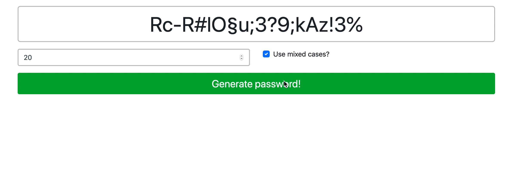

# Password Generator

Create a password generator WebApp;

1. Use the constant "charset" in your function (move it there). It contains all characters to use.

```javascript
const charset = 'abcdefghijklmnopqrstuvwxyz0123456789!§$%&/()=?#,;.:-_';
```

2. Your function should have 2 arguments:

   - length (Number) The length of the password
   - mixedCase (Boolean) Wether or not to use mixed cases (lowercase + uppercase)

3. If the second argument is true, use uppercase for every third character.
4. Use the function `getRandomInt()` to generate random numbers where you need them.
5. Register an event for the button to generate a new password.
6. Update the generated password inside of the "output" element.
7. Generate the first password as soon as the page is loaded, using a default length of 20.

Examples for generated passwords: - 876FocMkcCv98teXc(Ov - %lfXcrLt-#ke3r6R5§-? - Nd1Z\$yRx

**Bonus** 
1. Add an input field to define the length of the password.   
2. Add a checkbox to define if the password should youse mixed cases.  
3. Generate a new password on change of the input elements.  

**Optional:** Free free to use Bootstrap for styling.

> Hint: Refer to the representation below, for an idea of what your result should look like.


