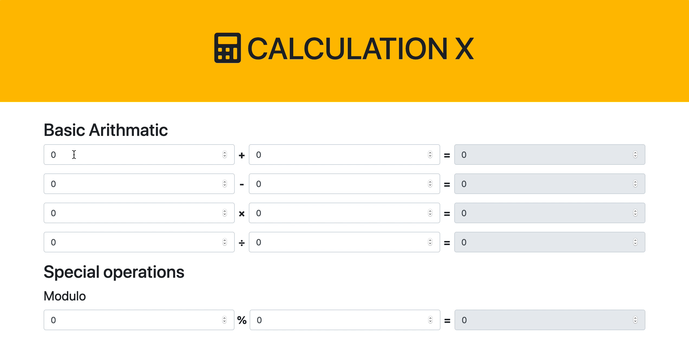

# Calculator

Create a Calculator app with the following operations:

- Addition
- Subtraction
- Multiplication
- Division
- Modulo

1. Create a function that calculates 2 numbers based on the operation.

1. **Optional:** Free free to use Bootstrap for styling.

> Hint: Refer to the representation below, for an idea of what your result should look like.

