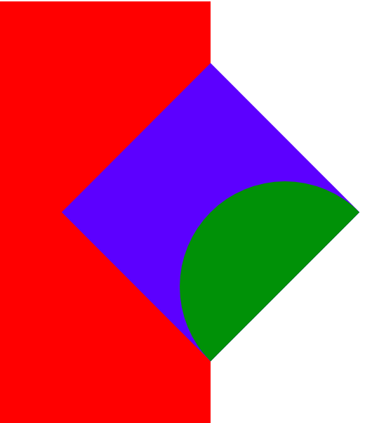

# HTML exercise 14/08/2019
## Transform
Please go to file `transform.html` and run it with live server.
You will find there list of few transform examples.
## Positioning

Try to style 3 divs to get the same result as on the picture using following properties:
- position, top, bottom, left, right
- transform (translate, rotate)
- border-radius
## Pseudo elements
First please open `solution.html` with live server so you can see what is the goal.
Next open `pseudo.html` and try to have the same effects using pseudo elements.
It can be done with following features:
- hover pseudo class
- transform (translate)
- transition (this is something new, so you can omit that if it's too much, btw. **this will only make your transform effects smooth**)